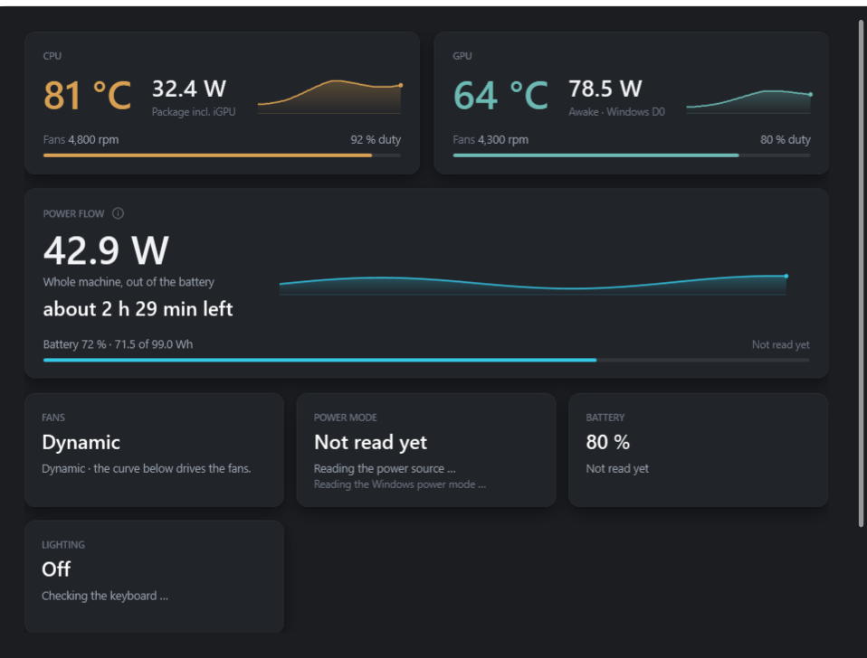
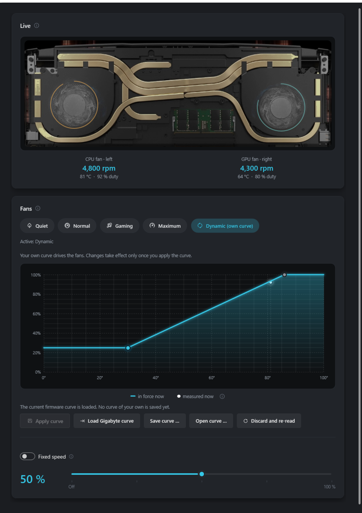
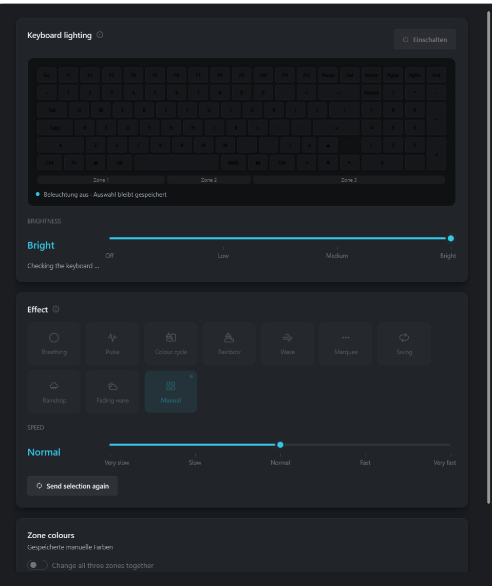
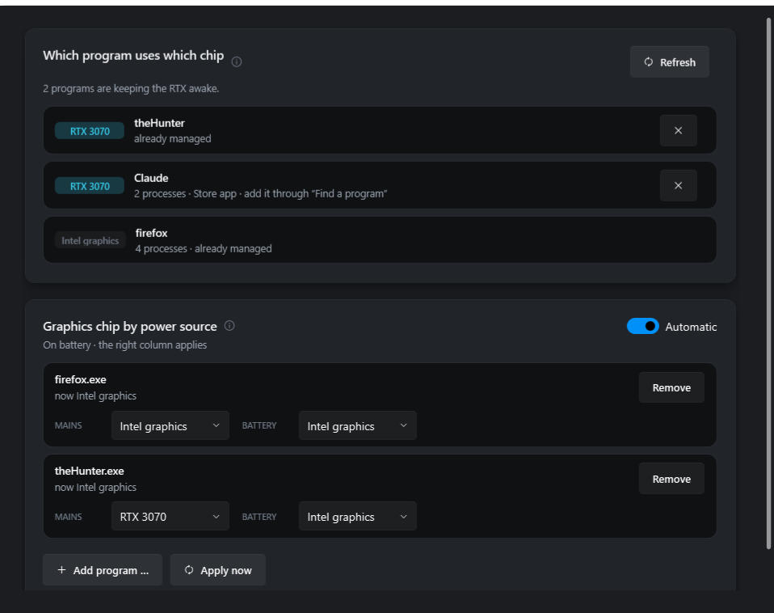
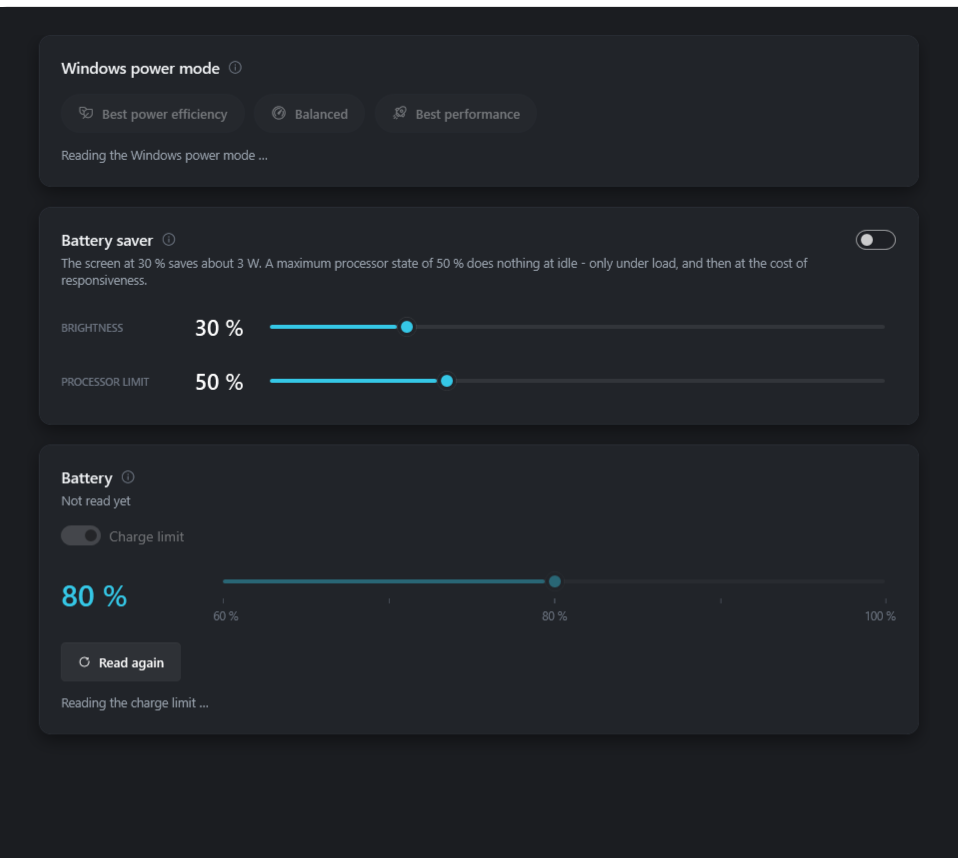

<div align="center">


# AORUS Control

**A replacement control panel for the Gigabyte AORUS 5 SE4.**
Fans, keyboard lighting, battery and graphics switching — in one window that starts fast,
stays out of the way, and never claims more than it has measured.

[](https://github.com/olischulze805/AorusControl/releases/latest)
[](https://github.com/olischulze805/AorusControl/actions/workflows/ci.yml)
[](LICENSE)
[](#install)
[](https://dotnet.microsoft.com/)



</div>

GitHub's release number counts asset requests, including repeat downloads and automatic
updates; it does not identify unique people. This README therefore deliberately does not
present that number as a user or installation count.

---

## Why this exists

Gigabyte Control Center never really worked on this machine. It was slow, it forgot
settings, parts of it silently did nothing, and it wanted a background stack far larger than
the handful of registers it actually writes. So the same hardware interfaces were taken apart
and this was written instead: small, and reliable about the few things it does.

**This project is entirely vibe coded.** I described what I wanted and Claude wrote it; I did
not hand-write the code line by line. What keeps that honest is in the design rather than in
my review of every statement:

| | |
|---|---|
| **Every write is read back** | and rolled back if the readback disagrees. |
| **Locked to one machine** | model `AORUS 5 SE`, BIOS `FB0F`, the exact USB keyboard interface. On anything else it refuses to write rather than guessing. |
| **It shows the device, not the click** | a write that fails moves the highlight back instead of pretending it worked. |
| **Nothing is claimed unmeasured** | figures in the interface come with what they are and are not; where a lever does nothing on this hardware, it says so. |
| **Tested without hardware** | automated checks run on any machine, and the real window is laid out offscreen in both languages so layout mistakes are caught rather than shipped. |

## What it does

### Dashboard

Temperatures and watts first, because those are the two things worth a glance. The power card
shows the one total this laptop can actually measure — what flows through the battery — and
turns it into remaining time.


### Cooling

Five fan profiles, a fixed speed across the firmware's whole range, and a draggable 15-point
curve. Fixed speed is held by a lease in a **separate process**, so if the panel crashes or is
killed, that process still hands the fans back to the firmware on its own.



### Keyboard

Three RGB zones, nine host-rendered effects, four brightness steps, and a live preview drawn
with the same function that feeds the keyboard. Fn+Space is picked up rather than fought.
Closing the app leaves the lighting exactly as you set it.



### Graphics

Which program is on which chip **right now**, read from the graphics kernel's own counters —
the NVIDIA driver is never asked, so a sleeping card stays asleep. A program on the RTX keeps
it awake even at zero load, so the list is also the answer to "why is my battery going".

Each managed program gets two rules of its own, one for mains and one for battery. A program
holding the card awake can be closed from here, after a question that says exactly what will
happen.



### Power &amp; battery

The Windows power mode, a battery saver, and a charge limit that survives a restart *and* a
suspend — the controller loses it, so the app checks and puts it back.

The saver caps the screen and the processor on battery, and says what each is worth here: the
panel is worth about 3 W, the processor cap nothing at idle. It works on a **copy** of your
power plan and switches to it, so your own plans are never written to — turning it off goes
back and deletes the copy. Only the battery side is written, so on mains the machine behaves
exactly as before and the switch can simply stay on.



## ⚠️ Before you use this

It is built for one laptop model and one firmware version. Fan control writes to the embedded
controller, so on a machine it does not recognise it stops instead of experimenting — **do not
remove those gates to "make it work" on your device.** BIOS and EC firmware are never flashed
or modified.

## Install

Download `AorusControl-<version>-Setup.exe` from the
[latest release](https://github.com/olischulze805/AorusControl/releases/latest).

It installs into your own user folder, brings its own .NET, and updates itself from there —
it looks once at launch and only says something if it finds a newer version. The installer is
not code-signed, so SmartScreen warns about an unknown publisher: **More info → Run anyway**.

Hardware access needs administrator rights, so Windows shows its usual prompt at launch.
Autostart uses a scheduled task rather than the registry Run key precisely so that prompt does
not come back at every login — and the task restarts the app if it ever crashes.

Settings and logs live under `%AppData%\AorusControl\`; the program itself under
`%LocalAppData%\AorusControl\`. Uninstalling leaves the settings.

## Language

German and English, switchable in **About &amp; updates** without a restart. It follows Windows
by default. Numbers follow the language too, so an English window does not print a decimal
comma.

## Build

Requires the .NET SDK pinned in `global.json`; Windows only.

```powershell
dotnet build --configuration Release
dotnet run --project tests/AorusControl.App.SmokeTests
dotnet run --project tests/AorusControl.UiChecks
```

The second command is the logic suite; the third lays the real window out offscreen at three
widths in both languages and writes the pictures to `research/runs/ui/`. Neither needs the
laptop.

CI and the release script pass `--verify-only`: they run the same layout checks without
regenerating the tracked README screenshots.

To build and verify a release installer locally (the version must match the app project):

```powershell
pwsh tools/Build-Release.ps1 -Version 0.5.9
```

Published releases are automated. Update the version in
`src/AorusControl.App/AorusControl.App.csproj`, add `research/releases/v<version>.md`, commit
both, then push the matching tag (for example `v0.5.9`). GitHub Actions validates that all
three versions agree, runs the build plus logic and offscreen UI checks, creates the installer,
full and delta update packages, writes SHA-256 checksums, and publishes the GitHub release.
If any check fails, no release is created.

Other useful scripts: `tools\Start-AorusControl.cmd` runs a build tree,
`tools\Start-FanNormalRestore.cmd` puts the fans back under firmware control if anything ever
goes sideways, and `tools\Build-AppIcon.ps1` draws the icon.

## Layout

| Path | |
|---|---|
| `src/` | `Core` (device gates and guarded setters), `App` (the WPF panel, one folder per feature), `Worker` (keeps fixed fan mode crash-safe), `Diagnostics` (read-only reports) |
| `tests/` | Console suites, no test framework, no hardware needed — logic, worker IPC, and offscreen window rendering |
| `tools/` | Launchers, the release build, and one script per experiment |
| `research/` | How the hardware was worked out, and why each decision went the way it did |
| `third-party/` | Not in version control — vendor installers and analysis tools; see its README |

`RESEARCH.md` has the verified ACPI method map. The documents under `research/` cover the fan
supervisor, the RGB protocol, the control-selection rules behind the interface, the power
measurements, and a long investigation into a keyboard that keeps falling off the USB bus.

## License

MIT — see [`LICENSE`](LICENSE). Use it, change it, ship it; just keep the copyright notice.

This covers the code and documentation here. Gigabyte's own software and firmware are not part
of this repository, and `research/` documents findings about the hardware rather than
reproducing vendor source.
